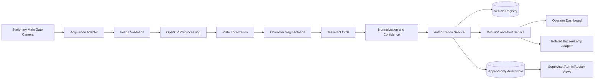

# CHAPTER THREE
# MATERIALS, METHODS, AND SYSTEM DESIGN

## 3.1 Introduction

This chapter defines the methodology and software design for the Automatic Plate Number Recognition (APNR) Access Control System proposed for the Nigeria Police Academy, Wudil, Kano (POLAC). The system is designed for the Main Gate and is constrained to standard Nigerian vehicle registration plates, with particular attention to Kano State and Federal Capital Territory (FCT Abuja) formats.

The operational environment is daylight operation between 07:00 and 18:00, a stationary camera positioned approximately three metres from the vehicle inspection point, and stationary or slow-moving vehicles travelling below 10 km/h. These conditions are deliberate system boundaries. Recognition quality outside them is not assumed and must result in an operator-review state rather than an automatic authorization.

The proposed system combines Python, OpenCV, Tesseract OCR, a relational database, browser-based role-specific dashboards, and an isolated gate-notification adapter. The system supports identification, authorization, alerting, and an electronic audit trail; it does not independently replace the judgment of authorized gate personnel.

## 3.2 Research and Development Method

A design-and-development methodology is adopted. The work proceeds through requirements analysis, system modelling, modular implementation, controlled testing, and operational evaluation.

The development stages are:

1. Define the Main Gate operating conditions and security roles.
2. Capture representative Nigerian plate images under daylight conditions.
3. Develop preprocessing and plate-localization routines.
4. Segment character regions and perform OCR with Tesseract.
5. Normalize OCR output and compare it with the vehicle registry.
6. Generate an authorization state and notification event.
7. Store the event and security action in an append-only audit trail.
8. Evaluate recognition accuracy, processing latency, access-control correctness, and audit completeness.

## 3.3 Operational Scope and Assumptions

### 3.3.1 Included Conditions

- Main Gate entry and exit operations at POLAC, Wudil.
- Standard Nigerian plates, especially Kano and FCT Abuja formats.
- Daylight operation from 07:00 to 18:00.
- Stationary or slow-moving vehicles below 10 km/h.
- Fixed camera installation approximately three metres from the inspection point.
- Visible, sufficiently illuminated, and substantially unobstructed plates.
- Manual review when OCR confidence is insufficient.

### 3.3.2 Excluded Conditions

- Night-time recognition without an approved illumination design.
- High-speed vehicle recognition.
- Severe rain, dust, glare, motion blur, or camera obstruction.
- Facial recognition, driver identification, or biometric processing.
- Automatic gate opening without a separately approved safety interlock.
- International or non-standard registration formats.
- Automatic approval of an unreadable plate.

## 3.4 System Architecture

The architecture is modular so that OCR, authorization, audit, and hardware integration can be tested independently.



### 3.4.1 Architectural Components

| Component | Responsibility |
|---|---|
| Camera adapter | Receives still frames or approved low-rate frames from the fixed camera. |
| Acquisition validator | Checks file type, image decodability, dimensions, and capture metadata. |
| Vision processor | Performs grayscale conversion, denoising, contrast enhancement, edge detection, thresholding, and morphology. |
| Plate localizer | Selects the most plausible rectangular plate region. |
| Segmenter | Separates character regions and orders them left-to-right. |
| OCR service | Uses Tesseract to produce candidate text and confidence values. |
| Authorization service | Compares normalized output with the vehicle registry. |
| Alert service | Produces visual state and hardware-alert events. |
| Audit service | Writes immutable security and access events. |
| Role-aware UI | Presents separate Admin, Supervisor, Operator, and Auditor workspaces. |
| Hardware adapter | Converts alert events into an isolated buzzer/lamp signal. |

## 3.5 Image Acquisition and Camera Installation

The camera is stationary and aligned to the vehicle inspection zone. The approximate three-metre distance is maintained so that the plate occupies enough pixels for OCR without requiring unrestricted wide-area tracking.

The camera installation should provide:

- High-resolution still capture or an approved low-rate stream.
- Stable mounting with minimal vibration.
- A direct or near-direct view of the front or rear plate.
- Adequate daylight exposure from 07:00 to 18:00.
- Network or serial access to the acquisition adapter.
- A privacy-respecting field of view limited to the gate lane.
- A documented camera identifier and health state.

The processing node should record capture time, camera identifier, frame dimensions, and acquisition status. A failed camera health check must be visible to the Operator and Administrator.

## 3.6 Image Preprocessing Pipeline

### 3.6.1 Image Validation

The acquisition validator rejects missing, unsupported, corrupted, or oversized images. It verifies that the image can be decoded and that its dimensions are suitable for processing.

### 3.6.2 Resizing

The original aspect ratio is preserved. Where the plate is too small for OCR, the image or localized crop is enlarged using cubic interpolation. Resizing improves character visibility but does not recover information lost through blur or compression.

### 3.6.3 Grayscale Conversion

The RGB image is converted to grayscale:

$$I_{gray}=0.299R+0.587G+0.114B$$

This reduces processing complexity and emphasizes luminance differences between plate characters and the plate background.

### 3.6.4 Noise Reduction

A bilateral or Gaussian filter may be applied to reduce sensor noise and compression artefacts. A bilateral filter is preferred where character edges must be preserved.

### 3.6.5 Contrast Adjustment

Contrast-limited adaptive histogram equalization may be used to compensate for uneven daylight. Enhancement must be bounded because aggressive contrast can create false character strokes.

### 3.6.6 Thresholding

Global Otsu thresholding and adaptive Gaussian thresholding may be evaluated as alternative binary representations:

$$B(x,y)=\begin{cases}255,&I(x,y)>T\\0,&I(x,y)\leq T\end{cases}$$

The system should retain more than one candidate representation when lighting conditions vary.

## 3.7 Plate Localization and Segmentation

### 3.7.1 Edge Detection

Canny edge detection identifies high-contrast boundaries. Contours are then extracted and ranked according to area, rectangularity, aspect ratio, and position within the expected inspection zone.

### 3.7.2 Morphological Operations

A rectangular structuring element may be used for:

- Opening to remove isolated noise.
- Closing to join broken plate boundaries.
- Dilation to strengthen connected character strokes.
- Erosion to remove small foreground artefacts.

### 3.7.3 Plate Candidate Ranking

A candidate plate region should satisfy bounded conditions such as:

- Approximately rectangular geometry.
- Plate-like horizontal aspect ratio.
- Adequate area relative to the frame.
- Character-like internal contrast.
- A position consistent with the fixed camera setup.

The localizer must be allowed to return no candidate. A failed localization is an `UNREADABLE` result, not a visitor or authorized result.

### 3.7.4 Character Segmentation

The localized plate crop is thresholded and connected components are extracted. Candidate character regions are filtered by height, width-to-height ratio, alignment, and spacing. Valid regions are sorted from left to right before OCR processing.

## 3.8 OCR and Plate Normalization

Tesseract OCR is configured for uppercase Latin characters and Arabic numerals used by the defined Nigerian plate scope. Multiple page segmentation modes may be evaluated because a plate is a short text line while a full-frame fallback may contain additional text.

The OCR service returns:

- Raw OCR text.
- Normalized plate text.
- OCR confidence.
- Image and crop references.
- Processing duration.
- Error or review reason.

Normalization converts text to uppercase, removes spaces and punctuation, and preserves the original raw output for review. Ambiguous substitutions such as `O/0` or `I/1` must not be silently changed without recording the original result.

The minimum confidence threshold is a configurable parameter. Results below that threshold are `UNREADABLE` and cannot be automatically authorized.

## 3.9 Authorization Decision Model

The decision service compares normalized OCR output with the vehicle registry.

```text
IF input is invalid:
    reject input and record acquisition failure
ELSE IF no plate is localized OR confidence < threshold:
    state = UNREADABLE
    require manual review
ELSE IF normalized plate matches an ACTIVE Allowed vehicle:
    state = AUTHORIZED
ELSE IF normalized plate matches an ACTIVE Blocked vehicle:
    state = BLACKLISTED
    create visual and audible alert
ELSE:
    state = UNAUTHORIZED
    create visual and audible alert
```

Expiration dates and vehicle activation status must be checked during every decision. A record that has expired or been deactivated cannot authorize entry.

## 3.10 Hardware and Software Materials

### 3.10.1 Hardware

- Fixed high-resolution daylight camera.
- Processing node capable of running Python, OpenCV, and Tesseract.
- Local or private-network database host.
- Security-booth display.
- Low-voltage active buzzer.
- Red warning lamp and optional green confirmation lamp.
- Opto-isolated relay or protected transistor/MOSFET driver.
- Fused, regulated buzzer power supply.
- Operator acknowledgement/silence control.
- UPS for processing node, network equipment, and controller.

### 3.10.2 Software

- Python 3.x.
- Flask application server.
- OpenCV for preprocessing and segmentation.
- Tesseract OCR and the appropriate language data.
- MySQL or another approved relational database.
- Werkzeug-compatible password hashing implementation using Argon2id or bcrypt in production.
- Bootstrap 5 and Bootstrap Icons for the browser interface.
- Automated tests for recognition, authorization, RBAC, persistence, and audit behavior.

The application should be installed in an isolated Python virtual environment. Tesseract is a separate operating-system installation and must be configured using `TESSERACT_CMD` or the approved system path.

## 3.11 Role-Based Access Control

RBAC is deny-by-default. A user receives permissions only through assigned roles. UI visibility is not a security boundary; every protected route and service operation must enforce authorization server-side.

### 3.11.1 Role Matrix

| Capability | System Admin | Security Supervisor | Gate Operator | Auditor / Investigator |
|---|---:|---:|---:|---:|
| View own workspace | Yes | Yes | Yes | Yes |
| Scan and monitor gate | Yes | Yes | Yes | Optional/read-only |
| Create/edit/deactivate users | Yes | No | No | No |
| Assign roles and permissions | Yes | No | No | No |
| CRUD authorized vehicles | Yes | Yes | No | No |
| CRUD blocked vehicles | Yes | Yes | No | No |
| Review and acknowledge alerts | Yes | Yes | Yes | Read-only |
| Manual gate override with reason | Yes | Yes | Yes, controlled | No |
| Search full audit trail | Yes | Yes | Limited recent events | Yes |
| Export audit records | Yes | Yes | No or limited | Yes |
| Change system parameters | Yes | No | No | No |
| Configure hardware | Yes | No | No | No |
| Delete audit records | No | No | No | No |

## 3.12 Credential and Session Security

### 3.12.1 Password Storage

Production password storage shall use Argon2id or bcrypt with a unique salt per password. Argon2id is preferred for new deployments. A recommended Argon2id baseline is:

- Memory: 64 MiB or higher, subject to measured hardware capacity.
- Iterations: 3 or higher.
- Parallelism: 2 or higher.
- Salt: cryptographically random and at least 16 bytes.
- Password length: at least 12 characters.
- Password policy: mixed character classes and rejection of common or breached passwords.

Passwords must never be stored in source code, templates, logs, CSV exports, or database plaintext columns.

### 3.12.2 Login Protection

- Five failed attempts trigger account lockout.
- Lockout duration is configurable and recorded in the audit trail.
- Repeated failures must be rate-limited by account and source.
- Lockout recovery requires an approved Admin action or controlled recovery process.
- First-login accounts have `is_first_login = TRUE` and must reset their password before accessing operational functions.

### 3.12.3 Session and Token Expiry

For browser sessions, use a server-side session or signed session with a **15-minute idle expiration** and:

- Fifteen-minute idle timeout.
- Secure, HttpOnly, SameSite cookies.
- Session identifier rotation after login and privilege change.
- Explicit logout invalidation.
- CSRF protection for all state-changing forms.

If JWT is used for an API, access tokens should expire after 15 minutes, use short-lived refresh-token rotation, and support revocation. JWT must not be used as a substitute for server-side authorization checks.

## 3.13 Database Schema Blueprint

The following relational design is the target production schema. Foreign keys, indexes, check constraints, and unique constraints must be enabled.

### 3.13.1 Users

```sql
CREATE TABLE users (
    id BIGINT PRIMARY KEY AUTO_INCREMENT,
    username VARCHAR(80) NOT NULL UNIQUE,
    password_hash VARCHAR(255) NOT NULL,
    is_active BOOLEAN NOT NULL DEFAULT TRUE,
    is_locked BOOLEAN NOT NULL DEFAULT FALSE,
    is_first_login BOOLEAN NOT NULL DEFAULT TRUE,
    failed_attempts SMALLINT NOT NULL DEFAULT 0,
    locked_until TIMESTAMP NULL,
    last_login_at TIMESTAMP NULL,
    created_at TIMESTAMP NOT NULL DEFAULT CURRENT_TIMESTAMP,
    updated_at TIMESTAMP NOT NULL DEFAULT CURRENT_TIMESTAMP ON UPDATE CURRENT_TIMESTAMP
);
```

### 3.13.2 Roles and Permissions

```sql
CREATE TABLE roles (
    id BIGINT PRIMARY KEY AUTO_INCREMENT,
    name VARCHAR(40) NOT NULL UNIQUE,
    description VARCHAR(255) NOT NULL
);

CREATE TABLE permissions (
    id BIGINT PRIMARY KEY AUTO_INCREMENT,
    permission_key VARCHAR(100) NOT NULL UNIQUE,
    description VARCHAR(255) NOT NULL
);

CREATE TABLE user_roles (
    user_id BIGINT NOT NULL,
    role_id BIGINT NOT NULL,
    PRIMARY KEY (user_id, role_id),
    FOREIGN KEY (user_id) REFERENCES users(id),
    FOREIGN KEY (role_id) REFERENCES roles(id)
);

CREATE TABLE role_permissions (
    role_id BIGINT NOT NULL,
    permission_id BIGINT NOT NULL,
    PRIMARY KEY (role_id, permission_id),
    FOREIGN KEY (role_id) REFERENCES roles(id),
    FOREIGN KEY (permission_id) REFERENCES permissions(id)
);
```

### 3.13.3 Vehicles

```sql
CREATE TABLE vehicles (
    id BIGINT PRIMARY KEY AUTO_INCREMENT,
    plate_number VARCHAR(20) NOT NULL UNIQUE,
    owner_name VARCHAR(120),
    rank_department VARCHAR(120),
    contact_details VARCHAR(160),
    classification ENUM('AUTHORIZED', 'BLACKLISTED', 'VISITOR') NOT NULL,
    expires_at DATE NULL,
    is_active BOOLEAN NOT NULL DEFAULT TRUE,
    notes VARCHAR(500),
    created_by BIGINT NOT NULL,
    created_at TIMESTAMP NOT NULL DEFAULT CURRENT_TIMESTAMP,
    updated_at TIMESTAMP NOT NULL DEFAULT CURRENT_TIMESTAMP ON UPDATE CURRENT_TIMESTAMP,
    FOREIGN KEY (created_by) REFERENCES users(id),
    INDEX idx_vehicles_plate_status (plate_number, classification, is_active)
);
```

### 3.13.4 Access Events

```sql
CREATE TABLE access_events (
    id BIGINT PRIMARY KEY AUTO_INCREMENT,
    plate_number VARCHAR(20) NOT NULL,
    event_type ENUM('ENTRY', 'EXIT') NOT NULL,
    decision ENUM('AUTHORIZED', 'UNAUTHORIZED', 'BLACKLISTED', 'UNREADABLE') NOT NULL,
    confidence DECIMAL(5,2) NOT NULL,
    camera_id VARCHAR(80) NOT NULL,
    image_reference VARCHAR(255),
    processing_time_ms INT,
    operator_id BIGINT NULL,
    occurred_at TIMESTAMP NOT NULL DEFAULT CURRENT_TIMESTAMP,
    INDEX idx_access_events_time (occurred_at),
    INDEX idx_access_events_plate (plate_number),
    FOREIGN KEY (operator_id) REFERENCES users(id)
);
```

### 3.13.5 Append-only Audit Logs

```sql
CREATE TABLE audit_logs (
    id BIGINT PRIMARY KEY AUTO_INCREMENT,
    event_id CHAR(36) NOT NULL UNIQUE,
    actor_user_id BIGINT NULL,
    action_key VARCHAR(100) NOT NULL,
    entity_type VARCHAR(60) NOT NULL,
    entity_id VARCHAR(80),
    before_json JSON NULL,
    after_json JSON NULL,
    source_ip VARCHAR(45),
    occurred_at TIMESTAMP NOT NULL DEFAULT CURRENT_TIMESTAMP,
    FOREIGN KEY (actor_user_id) REFERENCES users(id),
    INDEX idx_audit_actor_time (actor_user_id, occurred_at),
    INDEX idx_audit_action_time (action_key, occurred_at)
);
```

### 3.13.6 Immutability Controls

Audit records are write-once. Application code must expose insert and read operations only. No update or delete route is permitted. Database permissions should assign the application audit user `INSERT` and `SELECT` privileges without `UPDATE` or `DELETE` privileges on `audit_logs`.

For stronger assurance, deploy database triggers that reject `UPDATE` and `DELETE`, write audit records to append-only storage or WORM-compatible retention, and chain records with a hash of the previous record:

$$H_n = hash(H_{n-1} || event_n)$$

Hash chaining detects tampering but does not replace database access control, backups, or retention policy.

## 3.14 Route Protection Blueprint

```python
@login_required
@require_permission("vehicles:write")
def create_vehicle():
    ...

@login_required
@require_permission("audit:read")
def audit_log_view():
    ...

@login_required
@require_permission("gate:override")
def manual_override():
    ...
```

Middleware responsibilities:

1. Load the session or token.
2. Verify expiry, active state, and lock state.
3. Load role and permissions from trusted server-side data.
4. Reject missing permissions with HTTP 403.
5. Record denied sensitive actions in the audit trail.
6. Never rely on a hidden button or client-provided role.
7. Require CSRF validation for browser state changes.

## 3.15 Dashboard Design Blueprint

### 3.15.1 Gate Operator Workspace

The Operator workspace is scan-first and should contain:

- Live camera or latest-frame panel.
- Captured vehicle image.
- Cropped plate image.
- OCR string and confidence.
- Timestamp and camera identifier.
- Verification badge: `AUTHORIZED`, `UNAUTHORIZED`, `BLACKLISTED`, or `UNREADABLE`.
- Prominent green/red/amber decision state.
- Audible alarm status and acknowledge button.
- Manual plate-entry override with mandatory reason.
- Ten most recent scans.
- Current Operator identity and session expiry indicator.

Manual override must never silently replace OCR output. It stores the original OCR result, the corrected plate, the operator identity, the reason, and the time of the action.

### 3.15.2 System Administrator Workspace

The Admin workspace should contain:

- Total daily entries.
- Authorized and unauthorized counts.
- Average processing time in milliseconds.
- Camera system health.
- User management with add, edit, deactivate, lock, and password-reset actions.
- Vehicle registry with plate number, owner name, rank/department, contact, classification, expiration, and notes.
- Audit table with date, plate, operator, action, decision, and filters.
- CSV and PDF export actions subject to permission checks.
- Hardware configuration and connection status.

### 3.15.3 Supervisor Workspace

The Supervisor workspace should emphasize:

- Current gate status.
- Vehicle whitelist and blacklist management.
- Alert queue and acknowledgement history.
- Full search of access events.
- Operational reports.

### 3.15.4 Auditor Workspace

The Auditor workspace is read-only and emphasizes:

- Historical entry and exit records.
- Immutable action trails.
- Filter by date, plate, operator, action, and decision.
- Export with an export event recorded in `audit_logs`.

## 3.16 Alert and Buzzer Integration

The application emits a transport-neutral alert event. `BLACKLISTED` and `UNAUTHORIZED` decisions activate an audible and visual warning. `UNREADABLE` activates a manual-review warning but must not authorize entry.

Recommended physical architecture:

```text
APNR service -> private hardware adapter -> opto-isolated relay/driver -> low-voltage buzzer and red lamp
```

The controller must have a regulated supply, fuse protection, appropriate voltage/current ratings, and isolation between computing equipment and field wiring. Never connect a buzzer, relay coil, or gate mechanism directly to a computer port or unprotected GPIO.

The alert adapter should implement a bounded 3–5 second alarm, an acknowledgement input, a cooldown to avoid repeated alarms for the same frame, and a hardware-health result. The application must still write the access and alert event if the buzzer controller is offline.

## 3.17 Testing and Evaluation

### 3.17.1 Functional Tests

- Valid and invalid image acquisition.
- Nigerian Kano and FCT plate recognition.
- Unreadable and low-confidence handling.
- Authorized, unauthorized, and blacklisted decisions.
- Entry and exit event recording.
- Admin, Supervisor, Operator, and Auditor permission boundaries.
- Failed-login lockout after five attempts.
- First-login password reset enforcement.
- Fifteen-minute idle-session expiration.
- Audit immutability and denied update/delete operations.
- Alert activation and acknowledgement.

### 3.17.2 Performance Measures

$$Accuracy = \frac{correctly\ recognized\ plates}{total\ test\ plates} \times 100$$

$$CharacterAccuracy = \frac{correctly\ recognized\ characters}{total\ characters} \times 100$$

$$T_{total}=T_{acquisition}+T_{preprocessing}+T_{segmentation}+T_{OCR}+T_{database}$$

The report should present accuracy separately for clear, marginal, and rejected image conditions. It should not present a single accuracy value without stating the operating conditions.

### 3.17.3 Security Acceptance Criteria

- No password appears in source, templates, logs, or exports.
- Every privileged route rejects unauthorized roles.
- Every manual override has an actor, reason, and timestamp.
- Audit records cannot be updated or deleted through the application.
- Unreadable plates never become authorized by default.
- Browser sessions expire after the configured idle period.
- Account lockout and first-login reset behavior are testable.

## 3.18 Deployment and Maintenance

Deployment should use a dedicated virtual environment, environment variables for secrets, a production WSGI server, a private database network, regular database backups, and monitored logs. Development Flask mode must not be used in production.

Operational maintenance includes camera cleaning and alignment, Tesseract language-data verification, database backup testing, password rotation, account review, alert-controller tests, and periodic review of false recognition cases.

## 3.19 Chapter Summary

The proposed POLAC APNR system uses a fixed daylight Main Gate camera and a controlled image-processing pipeline consisting of validation, grayscale conversion, denoising, contrast adjustment, plate localization, morphological processing, character segmentation, and Tesseract OCR. The normalized result is evaluated against a central vehicle registry and produces an authorization decision, operator notification, and electronic audit record.

The design applies deny-by-default RBAC across four roles, secure password and session requirements, controlled manual overrides, and append-only audit records. Separate role-specific dashboards provide the Admin, Supervisor, Operator, and Auditor with only the functions required for their duties. The design therefore aligns the technical implementation with the POLAC operating scope while making its assumptions, security boundaries, hardware dependencies, and evaluation criteria explicit.
